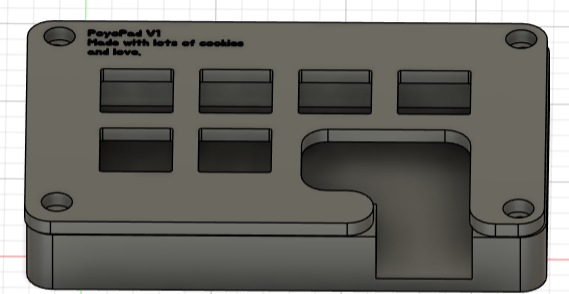
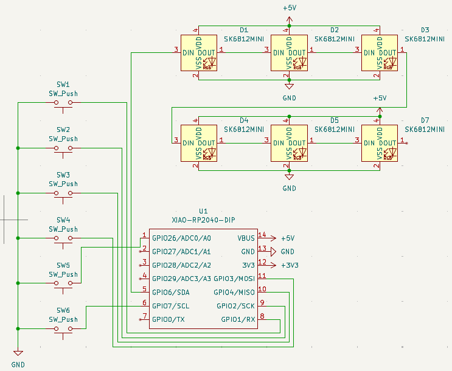
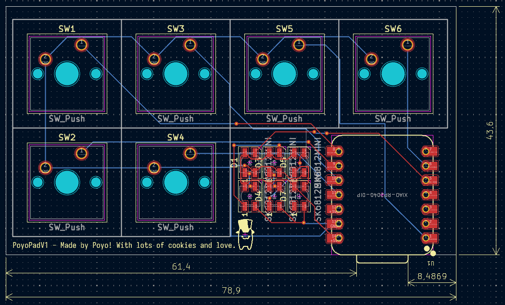
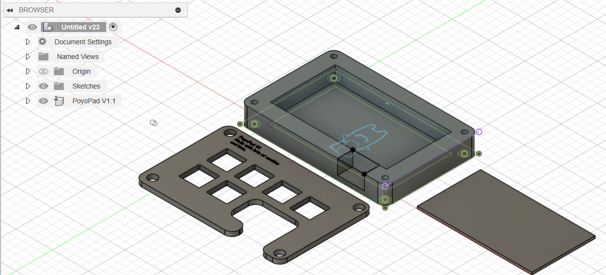

# poyopad-v1
My very very own macropad made in a few hours!

## Overview

This is will be the final look. Quite polished and it has a few inscriptions on the back and the top.

## Schematic

The schematic was overall fun to make. I had to ask @Cyao for a bit of help but other than that, SUPER COOL! 

## PCB Design

I loved arranging the actual PCB. It felt like organizing a desk... Entertaining.

## Case Design

Fusion 360 might've been the hardest part of them all. IT REFUSED TO WORK!!!!1! But in the end everything turned out very well.

## Bill of Materials (BOM)

| Component | Quantity | Description
|-----------|----------|-------------|
| MCU | 1 | XIAO RP2040
| Mechanical Switches | 6 | Default switches provided by Hack Club
| Keycaps | 6 | Standard keycaps
| Diodes | 9 | SK6812MINI |
| PCB | 1 | PCB made by me